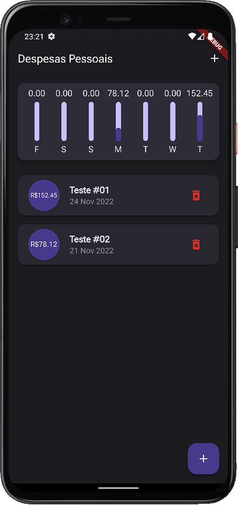
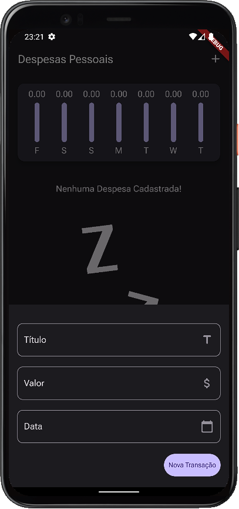

# personal-expenses-app

<p align="left">
   
   <!--  -->
   
</p>

App para cadastro de despesas pessoais desenvolvido com a linguagem Dart e framework Flutter.

## :hammer: Funcionalidades do projeto
* `Cadastro de despesas:` cadastro de despesas com data, título e valor.
* `Exclusão de despesas:` opção para excluir determinadas despesas cadastradas.
* `Gráfico:` gráfico com o total de despesas em cada dia da semana.

<br>
<div display: inline_block align="center">
   
   
</div>

## :file_folder: Acesso ao projeto
Você pode [acessar o código-fonte do projeto](https://github.com/GabrielSchiavo/personal-expenses-app) ou [baixá-lo](https://github.com/GabrielSchiavo/personal-expenses-app/archive/refs/heads/main.zip).

## :hammer_and_wrench: Abrir e rodar o projeto
Após baixar o projeto, você pode abrir com o Visual Studio Code. Para o projeto funcionar você deve ter configurado em seu PC:

* Flutter - Versão >=2.18.2 <3.0.0

Abra um terminal na pasta raiz do projeto e execute estes comandos:
```bash
dart pub get
```
```bash
flutter pub get
```

Agora ao abrir o projeto com o Visual Studio Code, abra o arquivo "main.dart" localizado na pasta "lib", agora pode executar ou depurar no seu smartphone, em um emulador Android ou iOS, no Windows ou no navegador.

## :white_check_mark: Tecnologias utilizadas
* `Dart - 2.18.2`
* `Flutter - 3.3.6`
* `intl - 0.17.0`
* `flutter launcher icons - 0.10.0`
* `flutter native splash - 2.2.14`
* `Material Design 3`
